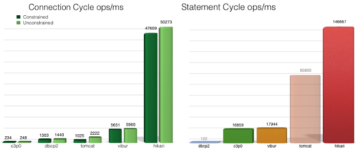

## JDBC 개요

#### JDBC(Java Database Connectivity)의 정의
- 자바를 이용한 데이터베이스 접속과 SQL 문장의 실행, 그리고 실행 결과로 얻어진 데이터의 핸들링을 제공하는 방법과 절차에 관한 규약
- 자바 프로그램 내에서 SQL문을 실행하기 위한 자바 API
- SQL과 프로그래밍 언어의 통합 접근 중 한 형태
- JAVA는 표준 인터페이스인 JDBC API를 제공
- 데이터베이스 벤더, 또는 기타 써드파티에서는 JDBC 인터페이스를 구현한 드라이버(driver)를 제공한다.

Q) java.sql패키지를 보면 대부분이 interface로 되어 있는 것을 알 수 있습니다.
이를 실제로 구현하는 것은 DBMS를 만든 회사입니다.
java.sql외에 JAVA가 인터페이스만 대부분 제공하는 패키지는 또 어떤 것이 있을까요?

#### JDBC클래스의 생성단계

*출처: https://www.edwith.org/boostcourse-web-be/lecture/58939/#*

#### JDBC 코드
``` java
public class  {
	public static void main(String[] args) {
		try {
			Connection con = null;
			Class.forName("com.mysql.jdbc.Driver");
			con = DriverManager.getConnection("jdbc:mysql://localhost","root", "1234");

			java.sql.Statement st = null;
			ResultSet rs = null;
			st = con.createStatement();
			rs = st.executeQuery("SHOW DATABASES");

			if (st.execute("SHOW DATABASES")) {
				rs = st.getResultSet();
			}

			while (rs.next()) {
				String str = rs.getNString(1);
				System.out.println(str);
			}
			rs.close;
			st.close;
			con.close;
		} catch (SQLException sqex) {
			System.out.println("SQLException: " + sqex.getMessage());
		}
	}
}
출처: https://www.dazhuanlan.com/2020/05/21/5ec63f1479e8a/
```
Class.forName()의 클래스로더를 통해 데이터베이스 드라이버를 로드한다. Class 클래스는 클래스들의 정보(클래스의 필드, 메서드, 클래스의 종류(인터페이스 등))를 담는 메타클래스이고 JVM은 이 Class 클래스를 통해 클래스들에 대한 정보를 로드한다. [자세한 내용](https://kyun2.tistory.com/23#:~:text=%EB%82%B4%EC%9A%A9%EC%9D%84%20%EC%82%B4%ED%8E%B4%EB%B3%B4%EB%A9%B4%20Class.forName,%EB%8F%99%EC%9E%91%EB%8F%84%20%ED%95%98%EC%A7%80%20%EC%95%8A%EB%8A%94%EB%8B%A4%EA%B3%A0%20%ED%95%A9%EB%8B%88%EB%8B%A4.)

#### Connection
DriverManager.getConnection() 실제 자바 프로그램과 데이터베이스를 연결해주는 메소드이다. 그 결과 Connection 객체를 반환한다. 보통 Connection하나당 트랜잭션 하나를 관리한다. 자바 프로그램과 DB 사이의 길로 볼 수 있다. 이 길을 통해 statement 객체에 SQL문을 담아 보내고 결과값을 받는다. 

## Connection Pool
여러 사용자가 웹사이트에 접속해 게시판 확인, 수정을 한다고 가정합니다. 
1. 데이터 검색 
2. 데이터 취득
3. 데이터 갱신

  한명의 접속자로 인해 3번의 DB 연결이 일어납니다. 만약 접속자가 N명(1000 < N)이라면 어떻게 될까요?   
  이러한 오버헤드를 방지하기 위해 Connection pool은 미리 일정 수의 Connection 객체를 생성하고 해당 Connection을 빌려주고 반납 받으며 관리하는 역할을 합니다. 이는 매번 Connection을 생성하고 닫는데 시간 소모하지 않으며 미리 만들어 놓은 Connection을 사용하며 속도를 높일 수 있습니다.   
  Connection Pool을 너무 크게 하면 메모리 소모가 클것이고, 적으면 connection이 많이 발생할 경우 대기시간이 발생하기 때문에 동시 접속자 수 등 서버 부하에 따라 크기를 조정해야 합니다.   
  DBCP에는 HikariCP와 Commons DBCP, Tomcat-JDBC, BoneCP 등이 있다. 


*출처: https://github.com/brettwooldridge/HikariCP*

**추가할 내용 스프링에서 hikariCP 설정**      
필요시 추가 내용   
[HikariCP 동작과정](https://brunch.co.kr/@jehovah/24) ps)해당 블로그 redis설명도 좋음.
[HikariCP가 빠른 이유](https://medium.com/datadriveninvestor/why-to-use-hikari-connection-pool-ce1a482cb9ab)


#### Datasource
javax.sql.DataSource 인터페이스는 ConnectionPool을 관리하는 목적으로 사용되는 객체다. Connection을 얻고 반납하는 등의 작업을 구현해야하는 인터페이스이다. Connection pool을 어플리케이션 단에서 어떻게 관리할지를 구현해야하는 인터페이스이다.   
Mybatis의 SqlSession, Hibernate에 TransactionManager등의 Close가 이루어지면 Connection을 ConnectionPool에 반납하게 된다.    
**추가하기**

#### SqlSession
**추가하기**   
SqlSession은 "DB와 데이터를 교환할 때 열리는 터널"이라고 볼 수 있다.   
서버와 DB 사이에서 Connection을 얻은 뒤 쿼리를 날려서 작업을 수행한다.

#### TransactionManager
**추가하기**

## MyBatis vs JPA
**해야할 일** +JDBC와 차이, datasource와 어떻게 연결되고 connection이 이루어지고, sql이 일어나고 close되는지, jdbc클래스와 연관시켜 설명하고 차이, 표형태로 요약   
[hikariCP와 mybatis 동작과정](https://m.blog.naver.com/PostView.nhn?blogId=duco777&logNo=221118828039&proxyReferer=https:%2F%2Fwww.google.com%2F)


### 추가 공부 내용  
- [JDBC SocketTimeOut](https://marine.pe.kr/m/1550)
- [Commons DBCP 이해하기](https://d2.naver.com/helloworld/5102792)

### 참고자료
- [[부스트코스] 웹 백엔드](https://www.edwith.org/boostcourse-web-be/lecture/58939/)
- 서적 코드로 배우는 스프링 웹 프로젝트 개정판
- https://www.dazhuanlan.com/2020/05/21/5ec63f1479e8a/
- https://brownbears.tistory.com/289
