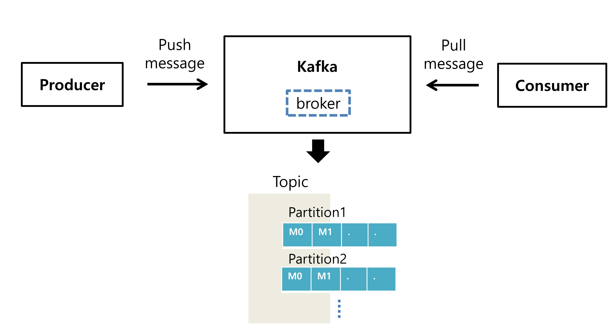

## 이슈
SMTP를 사용하여 대용량 메일을 보낼 시 많은 리소스를 사용   

10000명의 대상에게 메일을 보낼 경우, 각 대상마다 커스터마이징 된 템플릿과 함께 대상 수 만큼 SMTP를 통해 메일을 보냄   
한 번에 만명에게 보내기에는 많은 리소스를 사용하므로 이에 대한 해결책 필요   
   
### 해결 방안

1. DB로 구현
   - DB에 순서대로 보내야할 대상을 넣고 SEND STATE를 0(보내지 않음), 1(보냄), 2(완료) 업데이트하며 해결   
   => history성 자료면 NoSQL을 사용하여 저장하면 되지만 Send State라는 non_history성 자료를 포함하므로 매번 업데이트도 필요   
   단점: 디스크 저장 공간 낭비나 매번 C,D,U가 발생하며 비효율적

2. 메시지큐 사용
   - 생산성 증가(kafka 사용해본 경험이 있는 리더분)   
   - 비동기식 전송 = Queue에 넣고 나중에 처리
   - 많은 양의 프로세스들을 처리
   - 관련 오픈 소스 사용
   - 일반적으로 로그 관리에 사용   
   EX) RabbitMQ, kafka, 멤캐시 등
   
   
단점: DB보다 구현과 시스템 구조가 복잡해진다.

### RabbitMQ
 - 구성이 쉽다. 

 - 유연한 라우팅이 가능하면 관리 UI 가 편리하다. 

 - 제품 성숙도가 높다. 

 - 개방형 프로토콜을 위한 AMQP 를 구현위해 개발 

 - 필요에 따라 동기/비동기식이 가능함 

 - 소비자중심의 설계

 - 20k/sec 처리를 보장
   
   
### Apache Kafka 
 - 구독방식의 비동기식 구성

 - 고성능 고가용성 

 - 분산처리에 효과적으로 설계 됨. 

 - 생산자 중심의 설계 

 - 범용 메세징 시스템에서 제공되는 다양한 기능은 제공되지 않음.

 - 100k/sec 처리를 보장
 
 사용 사례: 메시징, 웹 사이트 활동추적, 지표, 로그 집계, 스트림처리
 
 고성능, 분산, 대용량, 노드장애대응 = 카프카   
 위 4가지가 아닌 큐의 다양한 기능 RabbitMQ   
 카프카는 오버스펙일 수 도 있다.
 
## Kafka
- Pub-Sub(Producer,Consumer) 모델

- 카프카의 구성요소 및 특징
   - **Producer(publisher)**: Kafka Topic에 데이터를 쓰는 측 (consumer와 사호 존재 여부를 모른다.)
   - **Consumer(subscriber)** : Kafka Topic에서 데이터를 읽고 처리하는 측
   - **broker, zookeepr** : Topic을 관리하는 카프카 서버. 동일한 노드내에서 여러개의 brkoker 서버를 띄울 수 있고, Zookeeper는 이러한 분산 메시지 큐의 정보를 관리하는 역할
   - **topic, partiton** :   
   Kafka에 저장되는 메시지는 topic으로 분류되고, topic은 여러 개의 partition으로 나뉠 수 있다.   
   partition안에는 메시지의 상대적 위치를 나타내는 offset이 있다.   
   이 offset정보를 이용해 이전에 가져간 메시지의 위치정보를 알 수 있고, 동시에 들어오는 많은 데이터를 여러 개의 파티션에 나누어 저장하기 때문에 병렬로 빠르게 처리할 수 있다.
   - **consumer group** : 하나의 topic을 읽어가기 위한 consumer들의 그룹. partition:Consumer Group = 1 : n 룰을 지켜주는 것이 병렬처리와 특정 컨슈머에게 문제가 생겼을 때, 다른 커슈머가 대신 읽을 수 있게 리밸런싱 가능
   - **replication** : replication 수를 임의로 지정하여 복제된 topic을 만들 수 있다. 특정 broker에 문제가 생겼을 경우 해당 broker의 역할을 다른 broker에서 즉각적으로 대신 수행할 수 있게 하기 위한 용도, leader&follower
   - **retention** :    
   Kafka의 데이터 보관 주기 설정.   
   기본적으로 7일 설정.   
   카프카의 특징으로 메모리가 아닌 디스크에 메시지를 저장하고 유지. consumer가 메시지를 읽어가면 바로 삭제하지 않고 일정기간 데이터를 유지한다. 이 설정을 할 수 있다.   
   cf) 디스크에 데이터를 쓰기 때문에 느리다 => 기존의 디스크 사용법과 달리 특정 영역의 디스크에 순차적으로 쓰기 때문에 읽어가는 영역의 범위가 확 줄어 속도 조금 빨라짐   
   또한 무조건 데이터를 디시크에 쓴다기 보다는 vm메모리의 일부를 페이지 캐싱으로 사용하기 때문에 속도가 빠르다.

# 해야할 일
- 데이터를 디스크에 저장하는데도 빠른 이유와 이에 대한 이유 중 vm메모리의 일부를 페이지 캐싱으로 사용하기에 속도가 빠르다는 게 어떤 의미인지 명확히 찾아보기
- zookeeper에 대해 알아보기
   
### 참고자료
- 메시지 큐 개념과 설명, RabbitMQ vs Kafka   
https://ellune.tistory.com/29

- 카프카 구성요소, 동작원리   
https://medium.com/@umanking/%EC%B9%B4%ED%94%84%EC%B9%B4%EC%97%90-%EB%8C%80%ED%95%B4%EC%84%9C-%EC%9D%B4%EC%95%BC%EA%B8%B0-%ED%95%98%EA%B8%B0%EC%A0%84%EC%97%90-%EB%A8%BC%EC%A0%80-data%EC%97%90-%EB%8C%80%ED%95%B4%EC%84%9C-%EC%9D%B4%EC%95%BC%EA%B8%B0%ED%95%B4%EB%B3%B4%EC%9E%90-d2e3ca2f3c2    
https://engkimbs.tistory.com/691   
https://epicdevs.com/17   

- kafka Producer 생성과 설명(코드)   
https://leeyh0216.github.io/2020-05-03/kafka_producer

- kafka가 데이터를 저장하는 방식retention      
https://gunju-ko.github.io/kafka/2019/03/16/%EC%B9%B4%ED%94%84%EC%B9%B4%EA%B0%80%EB%8D%B0%EC%9D%B4%ED%84%B0%EB%A5%BC%EC%A0%80%EC%9E%A5%ED%95%98%EB%8A%94%EB%B0%A9%EB%B2%95.html

- Kafka 공식사이트   
https://kafka.apache.org/intro
