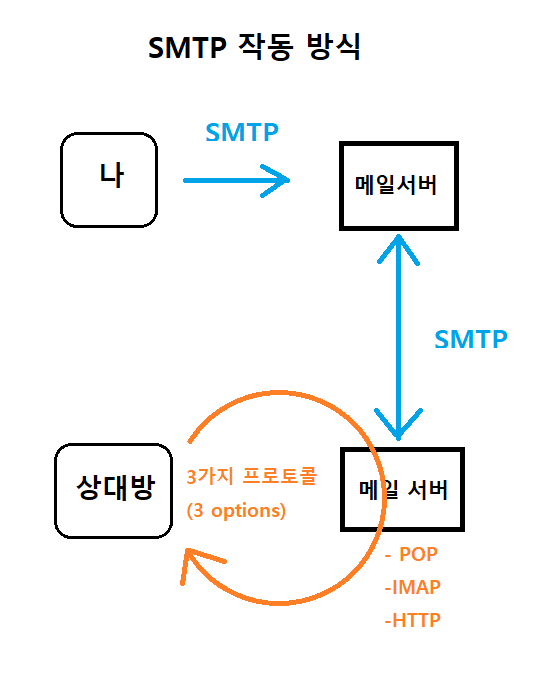
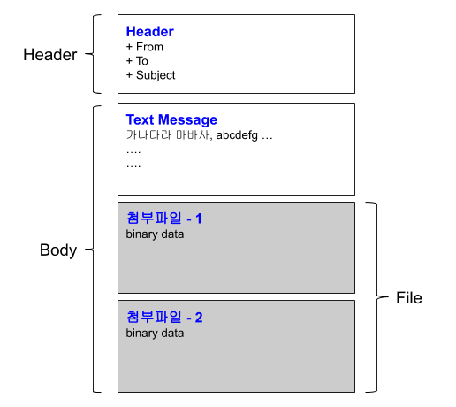

# SMTP

## SMTP
SMTP는 Simple mail Transfer protocol의 약자이다.   
이메일 전송에 직접적으로 쓰이는 응용 계층의 프로토콜이다.   
전송계층 프로토콜로는 TCP를 통해 전달합니다.
  

#### 예시 - 편지와 우체국(우체통)
편지를 보낼 때(SMTP) 우체국이 관리하는 우편통이나 우체국에 직접가서 쓴다.   
편지를 받을 때는 집 앞 우편함에 도착해있는 편지를 확인하면 된다.(POP, IMAP, HTTP)      
  

#### 동작 과정

> 내 메일 : abc@naver.com   
상대방 메일 : def@daum.net  
내가 상대방에게 메일을 보낸다고 가정해봅시다.   
naver 메일 서버와 daum 메일 서버가 각각 존재합니다.   
저는 naver 의 메일서버에 보낼데이터를 전송합니다. (SMTP)  
naver 메일 서버는 daum 메일 서버에게 메일을 보냅니다. (SMTP)   
그러면 그 메일 정보는 daum 메일 서버 보관함에 저장되고,   
상대방은 daum 메일 서버 보관함에서 메일을 가져오게 됩니다. (POP, IMAP, HTTP)  
>> **왜 메일을 가져올 때는 SMTP를 이용하지 않을까?**   
SMTP는 심플하기 때문에  Mail Box (Po box) 까지만 갈 수 있습니다.   
수신자는 태블릿, 컴퓨터, 휴대폰 등등에서 모두 메일을 확인할 수 있기 때문에,     
SMTP는  메일 서버 보관함까지만 작용하고, 수신자는 위 3가지 옵션을 통해 직접적으로 메일을 가져오게 됩니다.

출처: https://programming119.tistory.com/152
  

#### SMTP Format

  

메일 구조가 복잡해지면서, 아래의 문제를 해결 발생   
**1. 각 데이터들을 분리할 수 있어야 한다.**     
=> 각 데이터 사이를 boundary 문자열을 이용하여 분리   
**2. 각 데이터의 타입을 알아야 한다.**    
=> 데이터가 plain/text인지 binary 데이터인지 알아야한다. 그래서 smtp 각 데이터의 앞부분에 부가정보(애플리케이션 타입 정보 포함)를 담은 header를 두어 해결.    
**3. Base64 encode: SMTP는 printable한 텍스트 데이터를 처리하는 것을 목적으로 만들었다.**    
=> 바이너리 데이터를 텍스트로 변환할 필요가 생길 때, Base64( = 알파벳 대소문자 52 + 숫자10 + "+"기호 + "/"기호) encoding 기법을 사용한다. 데이터를 받으면 Base64 decode 과정을 통해 원래 데이터로 복원한다.   
    
     
#### 위와 같은 문제 해결을 통한 구조( 헤더 1개 + 각 헤더, 바디 같이 3개)

 

출처: https://www.joinc.co.kr/w/Site/Network_Programing/Documents/SMTP

  

#### 예제

---
  
# 자바(spring boot) smtp 설정
후에 실제 코드와 합쳐진다면 spring 폴더로 옮기기

**1. JavaMail 라이브러리**

https://ktko.tistory.com/m/entry/JAVA-SMTP%EC%99%80-Mail-%EB%B0%9C%EC%86%A1%ED%95%98%EA%B8%B0Google-Naver

- JavaMail 라이브러리 설정 및 import
- 구글 또는 네이버 SMTP 환경 설정
- 개발   
    1-1. 발신자 메일 계정과 비밀번호 설정    
    1-2. **Property**에 **SMTP 서버 정보** 설정(호스트, 포트, TLS 등)   
    1-3. SMTP 서버 정보와 사용자 정보를 기반으로 **Session 클래스**의 인스턴스 생성   
    1-4. **Message 클래스**의 객체를 사용하여 **수신자**와 내용, 제목의 **메시지**를 작성   
    1-5. **Transport 클래스**를 사용하여 작성한 메시지 **전달**   
 
InternetAddress\[\] 배열을 message.addRecipients(메시지, 수신자)를 통해 **다중 메일 전송 가능**

**사용하는 메일의 환경설정에서 smtp허용하거나 smtp 관련 결정이 정해진 경우는 어떻게?**   
  

**2. JavaMailSender**   
**MailSender(찾아보기)** 인터페이스 상속 받은 JavaMailSender   
1. spring-boot-starter-mail 의존성을 추가   
2. SMTP를 통해 메일을 보내기 위해 사용하는 SMTP Sever(GOOGLE, NAVER 등)의 요구사항에 맞는 설정
3. application.property에서 사용자 내용 설정함(우리는 DB에서 불러와 설정)
4. Message 객체를 통해 수신자, 제목, 메세지 설정 후 전송

MimeMessageHelper를 통해 이미지, 첨부파일 등을 포함한 메일 발송 가능   
HTML element가 많다면 MailTemplateServiec 사용하면 편리하다.

#### 예상 구현
1. 1번을 사용   
2. postgreSQL의 SMTP Table에서 가져와서 사용자 계정과 비밀번호, SMTP 서버 정보 설정
3. 연결 테스트는 Session.getInstance(정보, 사용자) 세션을 얻고,   
    session.getTransport("smtp")로 Transport 객체를 얻어 tr.connect()로 연결 테스트   
    **예외 확인 후 예외 핸들링**   

나중에 프로젝트에서 smtp 설정 후 메세지 보낼 시   
DB의 Template Table의 내용을 가져와   
Message클래스의 MimeMessage를 통해 첨부파일이나   
MailTemplateService를 통해 HTML   
메세지 설정 후 전송   
=> front 코드 확인 후 수정
  

---
  
### 참고 자료
- 메일 전송의 원리(POP3, IMAP 설명 포함)   
https://unabated.tistory.com/m/entry/mail-%EC%A0%84%EC%86%A1%EC%9D%98-%EC%9B%90%EB%A6%AC

- smtp 중점의 메일 전송 과정   
https://programming119.tistory.com/152
   
- **구체적인 smtp 설명(통신 예제 포함)**
https://www.joinc.co.kr/w/Site/Network_Programing/Documents/SMTP   
   
- 텔넷을 통한 smtp 연결테스트   
https://hope.pe.kr/50   
   
- 자바 smtp와  메일전송   
https://ktko.tistory.com/m/entry/JAVA-SMTP%EC%99%80-Mail-%EB%B0%9C%EC%86%A1%ED%95%98%EA%B8%B0Google-Naver   
   
- 스프링부트메일전송 sendermail   
https://victorydntmd.tistory.com/m/342   
   
- Java transport를  통한  연결확인   
https://stackoverflow.com/questions/3060837/validate-smtp-server-credentials-using-java-without-actually-sending-mail   
다른 테스트, 예외 확인하고 처리하기   
https://github.com/bbottema/simple-java-mail/issues/116   
